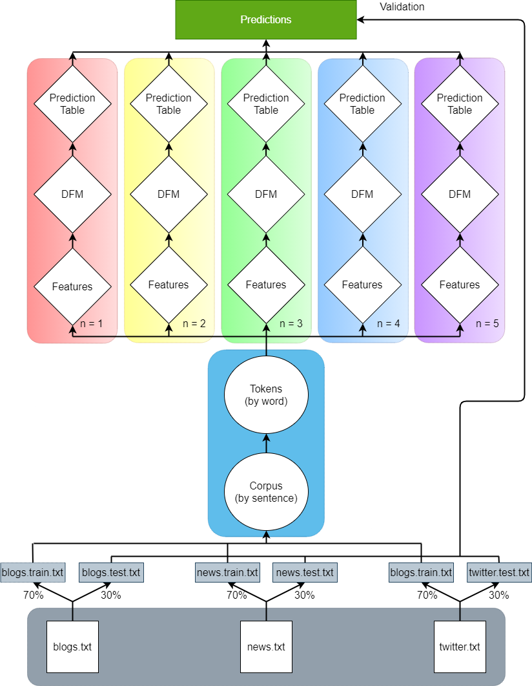

```{r setup, include=FALSE}
knitr::opts_chunk$set(echo = TRUE)
```

# Executive Summary
Text prediction is a well-known Natural Language Processing (NLP) task that is backed by a body of research both wide and deep.  It's become so ubiquitous that many of the most commonly-used applications today have predictive models built right into their virtual keyboard interface, and yet most do not know how these predictions are arrived at.  

In this project, we will be exploring this topic by building our own $n-\text{gram}$ language model from scratch, using an unstructured corpus of blog posts, news articles, and Tweets provided to us by SwiftKey (a division of Microsoft).  Once developed, we will use this model to efficiently predict text given a user's input to a proof-of-concept Shiny web app, similar to the functionality of the virtual keyboards mentioned earlier.  Though it is currently hosted on servers with an abundance of computational power, our model is designed to be easily deployed to any device, and includes optimizations for:

- **Size on Memory.**  Random Access Memory (RAM) is expensive and therefore limited in consumer electronics.  In order for our text prediction algorithm to work on as many devices as possible, as well as run smoothly alongside other important applications, we must keep the amount of memory utilized to a minimum.
- **Execution Time.**  Real-time text prediction of the kind we wish to create is utterly useless unless we can predict at least as fast as the average user types.  As such, we must take care to ensure that our predictions are served as fast as possible while maintaining acceptable accuracy.
- **Accuracy.**  For our predictions to be useful to the end user, they must accurately represent what the user wishes to express.

# Prediction Algorithm
Generally speaking, statistical language models are concerned with assigning a probability to a sentence or sequence of words in a corpus of text.  To represent this, let $w_1^L = (w_1,...,w_L)$ describe a continuous sequence of $L$ words in a natural language, starting from the first word in the sequence, $w_1$, and ending at its final one, $w_L$.  An incremental language model assigns a fixed probability to $w_1^L$ according to

$$P(w_1^L) = P(w_1, w_2, w_3, ..., w_L) = P(w_L|w_1,w_2,...,w_{L-1})$$

Which represents the chance $w_L$ occurs given the history $w_1, w_2, ..., w_{L-1}$.  This is a subtle point, but it is important to make special note of the presence of a conditional probability in the above equality, as it belies an underlying equivalence between in-place language modeling and the prediction of upcoming words given a particular history which we will leverage heavily.  

Using the chain rule of probability, we can rewrite the above expression as

$$P(w_L|w_1,w_2,...,w_{L-1}) = P(w_1)P(w_2|w_1)P(w_3|w_2,w_1)...P(w_L|w_1^{L-1}) = \Pi_{i=1}^LP(w_i|w_1^{i-1})$$

Where the capital $\Pi$ notation represents the [product operator](https://en.wikipedia.org/wiki/Multiplication#Product_of_a_sequence) applied to a sequence.  

While this expression theoretically allows for exact calculations of probability for arbitrary sequences of words, it has a number of shortcomings.  First, faithfully evaluating it requires complete knowledge of *all* the conditional probabilities involved in representing a natural language (which is an impossibility, as we will quickly see), and second, evaluating it for large phrases becomes computationally inefficient very quickly.  In fact, a linear increase in $L$ is associated an exponential increase in $w_1^L$.  As such, the best we can hope for is a good approximation.

An $n-\text{gram}$ approach accomplishes this by modeling each sequence as a [Markov Chain](https://en.wikipedia.org/wiki/Markov_chain), which assumes that most of the information needed to predict future tokens is encoded the $n-1$ most recent tokens ($w_{i-n+1}^{i-1}$) rather than the sequence's full history.  Formally, this approximation is equivalent to the statement:

$$P(w_i|w_1^{i-1}) \approx P(w_i|w_{i-n+1}^{i-1})$$

Which, provided a reasonable choice of $n$, greatly simplifies our calculations and allows us to safely discard the first $(L - n)$ tokens in each sentence without losing predictive capacity.  Of course, an approximation such as this has its limits when it comes to modeling grammar and syntax (in that it doesn't), but a simple Markovian assumption of this kind is ultimately what allows an $n-\text{gram}$ approach to accurately represent natural language without requiring syntactic analysis or higher-order abstraction.  There do exist [more complicated models](https://www.researchgate.net/publication/332149437_Syntactic_n-grams_The_Concept) which take these things into account, but for our purposes, the assumption of a simple Markov condition is more than adequate to obtain reasonable predictions.

## Naïve N-Gram Model: Maximum Likelihood
With the mathematical background covered, the first prediction algorithm we will discuss is the Maximum Likelihood method, which simply predicts $w_i$ according to its frequency normalized by the count of all other $w_i$ which are observed to follow the $(n-1)-\text{gram}$ $w_{i-n+1}^{i-1}$.  In this barebones solution, the probability of any specific token $w_i$ following $w_{i-n+1}^{i-1}$ is expressed using a Maximum Likelihood Estimator (MLE) as follows:

$$P_{MLE}(w_i|w_{i-n+1}^{i-1}) = \frac{C(w_{i-n+1}^{i-1}w_i)}{\Sigma_{w_i}C(w_{i-n+1}^{i-1}w_i)} = \frac{C(w_{i-n+1}^i)}{C(w_{i-n+1}^{i-1})}$$

Where $C(x)$ represents the count of $x$ across the corpus.  

While such a model would work just fine for purely in-sample text prediction, it fails to adequately address problems encountered when dealing with real-world, unconstrained language.  In practice, the predictive capacity of an $n-\text{gram}$ model of this kind is primarily limited by the size of the training data it is exposed to.  In our case, this is a large corpus, but it is distinctly not infinite in its scope.  As a result, there will always be a set of elements which we do not observe in our training sample, but which occur with some nonzero frequency in the natural language it is meant to represent.  Without a more sophisticated model, we will always fail to predict these unseen cases.

To deal with this, we can apply a smoothing technique to assign non-zero probabilities to $n-\text{grams}$ that are not observed in our base text.

## Additive Smoothing
The first and most basic smoothing technique is known as Laplace smoothing, which simply adds 1 to the count of all $n-\text{grams}$, both seen and unseen, to give the following probability measure:

$$P_{Laplace}(w_i|w_{i-n+1}^{i-1}) = \frac{C(w_{i-n+1}^i) + 1}{\Sigma_{w_i}[C(w_{i-n+1}^{i-1}w_i) + 1]} = \frac{C(w_{i-n+1}^i) + 1}{C(w_{i-n+1}^{i-1}) + |V|}$$

Where $V = \{w_{i-n+1}^i : C(w_{i-n+1}^i) > 0\} \cup \{\text{UNK}\}$ and $|V|$ represents the total size of our sample vocabulary.  This is equivalent to assuming a uniform Bayesian prior distribution where each $n-\text{gram}$ is modeled as occurring with equal probability in natural language.  This is an absurd proposition, to be sure, but even a heavily oversimplified solution such as this represents a comparatively huge improvement to the performance of our naïve model, allowing it for the first time to predict terms not explicitly observed in the training data (though with questionable accuracy).

More sophisticated ways to accomplish the same thing revolve around refining our Bayesian assumptions.  Lidstone smoothing generalizes the Laplace method by replacing the add-one method with an add-$\delta$ approach, such that:

$$P_{add}(w_i|w_{i-n+1}^{i-1}) = \frac{C(w_{i-n+1}^i) + \delta_{w_{i-n+1}^i}}{C(w_{i-n+1}^{i-1}) + \delta_{w_{i-n+1}^i}|V|} \quad\quad \delta > 0$$

As before, each $\delta_{w_{i-n+1}^i}$ should be chosen to represent a prior probability that is appropriate to the target language, with the accuracy of this method being limited by the quality of these choices.  The sum of all $\delta_{w_{i-n+1}^i}$ in this case represents the relative weight of the prior knowledge compared with the observed data, and should be adjusted in proportion to the expectation that this knowledge be considered correct despite evidence to the contrary.  Assuming one had access to high-quality prior knowledge, such as in relevance feedback or recommender systems, this could indeed be an effective algorithm, but for our purposes it is ultimately infeasible to assign appropriate $\delta_{w_{i-n+1}^i}$ to otherwise unconstrained input.

## Good-Turing
The second major smoothing algorithm - Good-Turing - attempts to derive its prior knowledge from the data itself rather than relying on external pseudocounts like additive smoothing.  To do this, the Good-Turing method redistributes some of the observed counts such that probability mass is reallocated from rare events to those that were never observed at all.  To demonstrate this, let $N$ be the total number of observed $n-\text{grams}$ in a sample corpus, and let $n_r$ be the number of $n-\text{grams}$ that occur exactly $r$ times within it, such that

$$N = \Sigma_{r=1}^{\infty}rn_r$$

Then, for each count $r$, we compute the Good-Turing adjusted count $r^*$ as follows:

$$r^* = (r + 1) \frac{n_{r+1}}{n_r}$$

Note that $N$, the total number of $n-\text{grams}$ observed, is preserved by this discounting such that $N = \Sigma_{r=0}^\infty r^*n_r = \Sigma_{r=1}^\infty rn_r$.  This conservation of observed counts allows us to proceed in a manner analogous to the Maximum Likelihood case, giving the following measure for the probability of seeing a particular $n-\text{gram}$ $w_{i-n+1}^i$:

$$P_{GT}(w_i|w_{i-n+1}^{i-1} : C(w_{i-n+1}^i) = r) = \frac{r^*}{N}$$

Combining the 3 equations above yields the following expression for the total probability mass retained by our observed $n-\text{grams}$

$$
\begin{equation}
  \begin{split}
    \Sigma_{w_{i-n+1}^i: C(w_{i-n+1}^i) > 0}P_{GT}(w_{i-n+1}^i) & = \frac{1}{N} \Sigma_{r=1}^{\infty}(r+1)\frac{n_{r+1}}{n_r} \\
     & = \frac{1}{N}(2n_2 + 3n_3 + ...) \\
     & = \frac{1}{N}(N - n_1) \\
     & = 1 - \frac{n_1}{N}
  \end{split}
\end{equation}
$$

Which implies that the leftover probability mass which the Good-Turing algorithm has shifted toward unseen  $n-\text{grams}$ be given by:

$$\Sigma_{w_{i-n+1}^i: C(w_{i-n+1}^i) = 0}P_{GT}(w_{i-n+1}^i) = \frac{n_1}{N}$$

As a result, we can express the complete Good-Turing probability measure as follows:

$$
P_{GT}(w_i|w_{i-n+1}^{i-1} : C(w_{i-n+1}^i) = r) = \left\{
  \begin{array}{11}
    \frac{n_1}{N} & \quad \text{if } r = 0 \\
    \frac{r^*}{N} & \quad \text{otherwise}
  \end{array}
\right.
$$

While Good-Turing has numerous documented problems (particularly at high $r$, where $r$ is especially noisy and/or $n_{r+1} = 0$), it introduces two fundamental ideas, (1) count adjustment, which we will see again in the context of Katz Backoff, and (2) that information about unseen priors can be derived using just the observed corpus rather than external estimation.  As such, it primarily serves as a basis on which other smoothing techniques build.

There does exist an extension of Good-Turing which attempts to shore up some of the problems that occur when $r$ is sparse and noisy.  In this extension, let $q$, $r$, $t$ be consecutive subscripts, for which $n_q$, $n_r$, and $n_t$ are all nonzero.  When $r = 1$, let $q = 0$, and when $r$ is the last nonzero frequency, let $t = 2r - q$.  We then define

$$Z_r = \frac{n_r}{0.5(t - q)}$$
Once these values have been ascertained, both $Z_r$ and $r$ are mapped to log space and fitted via linear regression $\log(Z_r) = a + b\log(r)$.  For small values of $r$, both sparsity and noise are constrained, and it is reasonable to reject this fit altogether, in favor of the standard definition of $n_r$.  For large $r$, however, values of $n_r$ should be derived from this regression line.  The constant over which this revised measure of $n_r$ ought to be considered is called $k$, and will be referenced again in the context of Katz smoothing.

## Jelinek-Mercer
The Jelinek-Mercer technique adds another important contribution in the form of interpolation, which supposes that $n-\text{grams}$ which contain more common sub-elements should be preferred over those that do not.  For instance, consider the phrases 'burnish the' and 'burnish thou'.  If, in a given corpus, $C(\text{burnish the}) = C(\text{burnish thou}) = 0$, then under both additive smoothing and Good-Turing:

$$P(\text{the|burnish}) = P(\text{thou|burnish})$$

Even though we know the word 'the' occurs with much higher frequency than 'thou' in everyday speech.  As such, we'd expect 'burnish the' to be far more common than 'burnish thou' in a more complete language model.  Luckily, we can emulate this fact by interpolating higher and lower-order models together, such that in a bigram model:

$$P_{interp}(w_i|w_{i-1}) = \lambda*P_{MLE}(w_i|w_{i-1}) + (1-\lambda)*P_{MLE}(w_i)$$

Where $\lambda$ is an experimental constant that represents the weighting balance between higher and lower-order models.  An optimal choice for this constant can be found using expectation maximization (EM) on either held-out data (held-out interpolation) or via cross-validation (deleted interpolation).  As expected, when we reevaluate the two phrases 'burnish the' and 'burnish thou' with this updated probability measure, we get

$$P(\text{the|burnish}) > P(\text{thou|burnish})$$

Since $P_{MLE}(\text{the}) >> P_{MLE}(\text{thou})$ in our corpus.  We can generalize this strategy to any $n$ by defining an $n$th-order model as a linear combination of the $n$th-order MLE model and $n-1$th-order interpolated model.

$$P_{interp}(w_i|w_{i-n+1}^{i-1}) = \lambda_{w_{i-n+1}^{i-1}} P_{MLE}(w_i|w_{i-n+1}^{i-1}) + (1-\lambda_{w_{i-n+1}^{i-1}}) P_{interp}(w_i|w_{i-n+2}^{i-1})$$

This is a recursive definition which is grounded at either a 1st-order MLE unigram model or a 0th-order uniform one, where

$$P_{unif}(w_i) = \frac{1}{|V|}$$

## Katz Backoff
Katz backoff smoothing is, in some sense, a combination of the Good-Turing and Jelinek-Mercer methods which involves both count adjustment and interpolation.  Where Good-Turing redistributes probability mass to all unseen $n-\text{grams}$ equally, Katz takes into account lower-order models to inform this redistribution.  It does so by "backing off" through (as opposed to combining) progressively shorter histories, where, at each backoff step $j$, the last $n-j$ components of an unobserved $n-\text{gram}$ are weighted according to Good-Turing estimation until a reliable prior estimation is achieved. 

According to Katz, $n-\text{grams}$ with count $r > 0$ are discounted according to a discount ratio $d_r \approx \frac{r^*}{r}$, where $r^*$ is the adjusted count associated with the Good-Turing algorithm.  If $r = 0$, Katz instead "backs off" to a lower-order model for its count estimate.  This gives the following expression for $C_{katz}$:

$$C_{katz}(w_{i-n+1}^i: C(w_{i-n+1}^i) = r) = \left\{
  \begin{array}{11}
    d_rr & \quad \text{if } r > 0 \\
    \alpha_{w_{i-1}^i}C_{katz}(w_{i-n+2}^i) & \quad \text{otherwise}
  \end{array}
\right.$$

Where $\alpha$ is a normalization constant computed to cancel out the probability mass $\beta$ leftover from the Good-Turing discounting step, such that $\Sigma_{w_{i-n+1}^i}C_{katz}(w_{i-n+1}^i)=\Sigma_{w_{i-n+1}^i}C(w_{i-n+1}^i) = N$.  Each $\beta(w_{i-n+1}^{i-1})$ is therefore defined as follows:

$$\beta(w_{i-n+1}^{i-1}) = 1 - \Sigma_{w_i:C(w_{i-n+1}^i)>0}P_{GT}(w_i|w_{i-n+1}^{i-1})$$

Which constrains $\alpha_{w_{i-n+1}^{i-1}}$ to

$$\begin{equation}
  \begin{split}
    \alpha_{w_{i-n+1}^{i-1}} & = \frac{\beta(w_{i-n+1}^{i-1})}{\Sigma_{w_i:C(w_{i-n+1}^i)>0}P_{katz}(w_i|w_{i-n+2}^{i-1})} \\
    & = \frac{1 - \Sigma_{w_i:C(w_{i-n+1}^i) > 0}P_{GT}(w_i|w_{i-n+1}^{i-1})}{1 - \Sigma_{w_i:C(w_{i-n+1}^{i}) > 0}P_{GT}(w_i|w_{i-n+2}^{i-1})}
  \end{split}
\end{equation}$$

As such, the conditional probability given by the Katz backoff method is as follows:

$$P_{katz}(w_i|w_{i-n+1}^{i-1}) = \left\{
  \begin{array}{11}
    P_{GT}(w_i|w_{i-n+1}^{i-1}) & \quad \text{if } C(w_{i-n+1}^i) > 0 \\
    \alpha_{w_{i-n+1}^{i-1}}P_{katz}(w_i|w_{i-n+2}^{i-1}) & \quad \text{otherwise}
  \end{array}
\right.$$

From here, Katz considers a modified solution which considers alternate choices of $d_r \not\approx \frac{n_1}{N}$.  For $r > k$, where Katz suggests $k = 5$, we assume the observed counts are reliable and take $d_r = 1$.  For $r \leq k$, however, Katz proposes the alternate definition of $d_r$ shown below:

$$d_r = \frac{\frac{r^*}{r} - \frac{(k+1)n_{k+1}}{n_1}}{1 - \frac{(k+1)n_{k+1}}{n_1}} \quad \text{for } 1 \leq r \leq k$$

Which maintains the normalization condition, but decreases the amount of Good-Turing computations to only those elements whose counts are small ($<k$), alleviating the issues faced by Good-Turing at high $r$.  This revised model results in the following probability measure:

$$P_{katz}(w_i|w_{i-n+1}: C(w_{i-n+1}^i) = r) = \left\{
  \begin{array}{11}
    P_{MLE}(w_i|w_{i-n+1}^{i-1}) & \quad \text{if } r > k \\
    \frac{d_rr}{C(w_{i-n+1}^{i-1})} & \quad \text{if } 1 \leq r \leq k \\
    \alpha_{w_{i-n+1}^{i-1}}P_{katz}(w_i|w_{i-n+2}^{i-1}) & \quad \text{otherwise}
  \end{array}
\right.$$

When either model is implemented, values for $\alpha$ are usually precomputed and stored locally, which provides the method its computational efficiency.

## Kneser-Ney
The Kneser-Ney algorithm, which is generally considered to be the highest performance smoothing model, is a modification of a Maximum Likelihood interpolation model (a la Jelinek-Mercer) that implements absolute discounting to redistribute count mass as well as a novel way of computing unigram counts.  Instead of assigning a unigram count $C(w_i)$ equal to the total number of occurrences of $w_i$ across the corpus, Kneser-Ney defines it as the number of different *contexts* which the unigram *continues* (i.e. how many bigrams it completes), and it therefore heavily discounts unigrams which are in some sense context-dependent.  The classic example is the 'Francisco' component of the proper name San Francisco, which always follows the unigram 'San' and would thus receive a Kneser-Ney unigram count of one, regardless of how many times the full bigram 'San Francisco' occurs in the base text.  Once these continuation counts have been computed for each unigram, Kneser-Ney assigns each a probability

$$P_{KN}(w_i) = \frac{C_{cont}(w_i)}{\Sigma_{w'}C_{cont}(w')}$$

The other major component of the Kneser-Ney algorithm, Absolute Discounting, is a simple way of redistributing count mass wherein a constant amount $0 < \delta < 1$ is subtracted from each observed count.  This is expressed in the Kneser-Ney bigram probability measure

$$P_{KN}(w_i|w_{i-1}) = \frac{\text{max}(C(w_{i-1}, w_i) - \delta, 0)}{\Sigma_{w'}C(w_{i-1}, w')} + \lambda_{w_{i-1}}P_{KN}(w_i)$$

Since each count is reduced by the exact same amount in this scheme, it is extremely easy to compute the renormalization constant $\lambda_{w_{i-i}}$.  All we need is the amount of probability mass subtracted from each observation and the total number of observations.  The product of these then gives the leftover probability that we can assign to lower-order models, like so:

$$\lambda_{w_{i-1}} = \frac{\delta}{\Sigma_{w'}C(w_{i-1},w')}|\{w': C(w_{i-1}, w_i) > 0\}|$$

And, as with other models, the above process can be extended up to arbitrary $n$ via recursion.

## "Stupid" Backoff
So-called "Stupid" Backoff is an $n-\text{gram}$ ranking technique created by engineers at Google to rapidly iterate through a distributed (and very large) set of $n-\text{gram}$ tables.  The name refers to the simplicity of the technique, where the probability obtained at each backoff step is simply scaled by a constant amount rather than complex normalizing coefficients as in the other models.  As such, Stupid Backoff does not return proper probabilities for its predictions, and the sum of resulting scores may not sum to 1 like a traditional language model.  Despite this, Stupid Backoff can be used quite effectively for $n-\text{gram}$ prediction, and its accuracy approaches that of Kneser-Ney when exposed to large datasets.

The probability measure for Stupid Backoff is as follows:

$$
P_{SB}(w_i|w_{i-n+1}^{i-1}) = \left\{
  \begin{array}{11}
    P_{MLE}(w_i|w_{i-n+1}^{i-1}) & \quad \text{if } C(w_{i-n+1}^i) > 0 \\
    \alpha P_{SB}(w_i|w_{i-n+2}^{i-1}) & \quad \text{otherwise}
  \end{array}
\right.
$$

Where the backoff weight $\alpha$ is a simple, experimental constant, usually set to $\lambda = 0.4$.

# Implementation in R
Before we can even get to implementing any of the above smoothing strategies, we first have to process our base text into a series of $n-\text{gram}$ frequency tables that we can perform fast searches on and which (preferably) take up the minimum amount of space possible.  The only viable prepackaged solution that satisfies all of these requirements in R is the fantastic [data.table](https://rdatatable.gitlab.io/data.table/) package, which utilizes an underlying Radix-Trie implementation with $O(\log(n))$ search and well-optimized memory profiles.  It also allows for fast joins between tables, enabling us to save on overall memory utilization by mapping the more specialized parameters (adjusted Good-Turing counts and Katz coefficients, for instance) onto a lookup dictionary which is then joined with the original data during prediction to obtain results.  This allows us to eliminate several of the columns of what would otherwise be a prohibitively large lookup table and thereby optimize memory usage further.  As a result, all of the underlying framework of this app is written in the common data.table syntax.  For the processing of the text itself (tokenization, creation and filtration of $n-\text{grams}$, and frequency calculations), the [quanteda](https://quanteda.io/index.html) package was used.  Following are details about the build information of these dependencies:

``` {r}
require(data.table)
require(dplyr)
require(quanteda)
require(R6)
require(readr)
```

## Tokenization, Filtration, and Preprocessing
The first thing that must be defined before we move on with preprocessing is a function to tokenize and filter an arbitrary sequence of text, which we can apply to both our input data and our query strings when we search for predictions.  It is vital that this be the exact same function, as if it weren't, the dissimilarity between query data and lookup data would lead to a loss in accuracy.  This function also needs to be able to perform well even on the empty string "", as that will be the history used to represent unigram probabilities during prediction.

``` {r}
available_filters <- c("punctuation", "symbols", "numbers", "url", 
                       "profanity", "stopwords", "noletters",
                       "non-ascii")

tokenize_and_filter <- function(input, filters, language_code) {
  stopifnot(is.character(filters), 
            all(sapply(filters, function(f) f %in% available_filters)))
  if (length(input) == 1 && input == "") {
    return("")
  }
  
  tok <- as.character(tokens(input, what = "sentence")) %>% 
    tokens(remove_punct = "punctuation" %in% filters,
           remove_symbols = "symbols" %in% filters,
           remove_numbers = "numbers" %in% filters,
           remove_url = "url" %in% filters) %>%
    tokens_tolower()

  if ("stopwords" %in% filters) {
    code_map <- data.table(code = c("de_DE", "en_US", "fi_FI", "ru_RU"),
                           val = c("german", "english", "finnish", "russian"),
                           key = "code")
    tok <- tokens_remove(tok, stopwords(code_map[language_code, val]))
  }
  if ("profanity" %in% filters) {
    if (!file.exists("profanity_list.txt")) {
      profanity_url <- "https://www.cs.cmu.edu/~biglou/resources/bad-words.txt"
      download.file(profanity_url, "profanity_list.txt")
    }
    tok <- tokens_remove(tok, read_lines("profanity_list.txt"))
  }
  if ("noletters" %in% filters) {
    tok <- tokens_remove(tok, "^[^\\p{L}]+$", valuetype = "regex")
  }
  if ("non-ascii" %in% filters) {
    tok <- tokens_remove(tok, "[^[:ascii:]]", valuetype = "regex")
  }
  tok
}
```

Once this is defined, all the other preprocessing necessary to create usable lookup tables is encapsulated into a single R6 class for simplicity and ease of use.  The code to produce this class is again below:

``` {r}
ngrams <- R6Class("ngrams", public = list(
  language_code = NA,
  n = NA,
  min_threshold = NA,
  max_rank = NA,
  replace = NA,
  seed = NA,
  sample_prob = NA,
  filters = NULL,
  
  initialize = function(language_code, n, min_threshold = 3, max_rank = Inf,
                        replace = FALSE, seed = 12345, sample_prob = 0.7,
                        filters = c("punctuation", "symbols", "numbers",
                                    "noletters")) {
    stopifnot(is.character(language_code), length(language_code) == 1, 
              dir.exists(file.path("final", language_code)))
    stopifnot(is.numeric(n), length(n) == 1, n >= 1)
    stopifnot(is.numeric(min_threshold), length(min_threshold) == 1)
    stopifnot(is.numeric(max_rank), length(max_rank) == 1, max_rank >= 1)
    stopifnot(is.logical(replace), length(replace) == 1)
    stopifnot(is.numeric(seed), length(seed) == 1)
    stopifnot(is.numeric(sample_prob), length(sample_prob) == 1,
              sample_prob > 0, sample_prob <= 1)
    stopifnot(is.character(filters), 
              all(sapply(filters, function(f) f %in% available_filters)))
    
    self$language_code = language_code
    self$n = as.integer(n)
    self$min_threshold = as.integer(min_threshold)
    self$max_rank = max_rank
    self$replace = replace
    self$seed = seed
    self$sample_prob = sample_prob
    self$filters = filters
  }
),

private = list(
  .corpus = NULL,
  .tokens = NULL,
  .features = NULL,
  .featurecounts = NULL,
  .gt_counts = NULL,
  .table = NULL
),

active = list(
  corpus = function(value) {
    if (missing(value)) {
      if (!is.null(private$.corpus) && !self$replace) {
        private$.corpus
      } else {
        corp_path <- file.path("final", self$language_code, "corpus.Rdata")
        if (file.exists(corp_path) && !self$replace) {
          print(sprintf("loading corpus from %s", corp_path))
          load(file = corp_path)
          private$.corpus <- corp; rm(corp); gc(FALSE)
          private$.corpus
        } else {
          print("generating train/test sets...")
          options(readr.show_progress = FALSE)
          files <- list.files(file.path("final", self$language_code))
          for (f in files) {
            if (grepl(pattern = "(?<!train|test).txt", f, perl=TRUE)) {
              f <- file.path("final", self$language_code, f)
              base_name <- tools::file_path_sans_ext(basename(f))
              trn_path <- file.path(dirname(f), paste0(base_name, ".train.txt"))
              tst_path <- file.path(dirname(f), paste0(base_name, ".test.txt"))
              cond1 <- !(file.exists(trn_path) && file.exists(tst_path))
              if (cond1 || self$replace) {
                text <- read_lines(f)
                set.seed(self$seed); prob <- self$sample_prob
                in_trn <- rbinom(n = length(text), size = 1, prob = prob)
                fwrite(list(text[as.logical(in_trn)]), trn_path, quote = FALSE)
                fwrite(list(text[!as.logical(in_trn)]), tst_path, quote = FALSE)
              }
            }
          }
          
          # "\u302A\u302D\u302E\u302E\u302B\u302C" - forbidden token
          print("reading training data...")
          files <- list.files(file.path("final", self$language_code))
          fulltext <- unlist(lapply(files, function(f) {
            if (grepl(pattern = "\\.train\\.txt", f, perl=TRUE)) {
              read_lines(file.path("final", self$language_code, f))
            }
          }), use.names = FALSE)
          
          print("building corpus...")
          corp <- corpus(fulltext)
          save(corp, file = corp_path)
          private$.corpus <- corp; rm(corp); gc(FALSE)
          private$.corpus
        }
      }
    } else {
      stop("`$corpus` is read-only")
    }
  },
  
  tokens = function(value) {
    if (missing(value)) {
      if (!is.null(private$.tokens) && !self$replace) {
        private$.tokens
      } else {
        tok_path <- file.path("final", self$language_code, "tokens.Rdata")
        if (file.exists(tok_path) && !self$replace) {
          print(sprintf("loading tokens from %s", tok_path))
          load(file = tok_path)
          private$.tokens <- tok; rm(tok); gc(FALSE)
          private$.tokens
        } else {
          corp <- self$corpus
          print("tokenizing and filtering corpus...")
          tok <- tokenize_and_filter(corp, self$filters, self$language_code)
          save(tok, file = tok_path)
          private$.tokens <- tok; rm(tok); gc(FALSE)
          private$.tokens
        }
      }
    } else {
      stop("`$tokens` is read-only")
    }
  },
  
  features = function(value) {
    if (missing(value)) {
      if (!is.null(private$.features) && !self$replace) {
        private$.features
      } else {
        features_name <- sprintf("features.%sgrams.Rdata", self$n)
        features_path <- file.path("final", self$language_code, features_name)
        if (file.exists(features_path) && !self$replace) {
          print(sprintf("loading features from %s", features_path))
          load(file = features_path)
          private$.features <- features; rm(features); gc(FALSE)
          private$.features
        } else {
          tok <- self$tokens
          if (self$n == 1) {
            tok
          } else {
            print("calculating features...")
            features <- tok %>% tokens_ngrams(n = self$n, concatenator = " ")
            save(features, file = features_path)
            private$.features <- features; rm(features); gc(FALSE)
            private$.features
          }
        }
      }
    } else {
      stop("`$features` is read-only")
    }
  },
  
  featurecounts = function(value) {
    if (missing(value)) {
      if (!is.null(private$.featurecounts) && !self$replace) {
        private$.featurecounts
      } else {
        featurecounts_name <- sprintf("featurecounts.%sgrams.Rdata", self$n)
        featurecounts_path <- file.path("final", self$language_code, 
                                        featurecounts_name)
        if (file.exists(featurecounts_path) && !self$replace) {
          print(sprintf("loading feature counts from %s", featurecounts_path))
          load(file = featurecounts_path)
          private$.featurecounts <- counts; rm(counts); gc(FALSE)
          private$.featurecounts
        } else {
          features <- self$features
          print("calculating feature counts...")
          counts <- colSums(features %>%
                              tokens_group(groups = rep("all", ndoc(.))) %>%
                              dfm(verbose = FALSE))
          
          save(counts, file = featurecounts_path)
          private$.featurecounts <- counts; rm(counts); gc(FALSE)
          private$.featurecounts
        }
      }
    } else {
      stop("`$featurecounts` is read-only")
    }
  },
  
  gt_counts = function(value) {
    if (missing(value)) {
      if (!is.null(private$.gt_counts) && !self$replace) {
        private$.gt_counts
      } else {
        print("computing Good-Turing counts...")
        if (!is.null(private$.table) && !self$replace) {
          rawcounts <- self$table[, count]
        } else {
          rawcounts <- self$featurecounts
        }
        counts <- as.data.table(table(rawcounts))
        names(counts) <- c("r", "nr")
        counts[, r := as.numeric(r)]
        counts[, q := shift(r, 1, type = "lag", fill = 0)]
        counts[, t := shift(r, 1, type = "lead", fill = 2 * max(r) - max(q))]
        counts[, logr := log(r)]
        counts[, logZ := log(nr / (0.5 * (t - q)))]
        setkey(counts, r)
        fit <- with(counts, lm(logZ ~ logr))
        
        use_LGT <- FALSE
        b <- as.numeric(fit$coefficients[2])
        if (b > -1) stop(sprintf("LGT not applicable (b > -1): %s", b))
        max_r <- max(counts$r)
        rstar <- sapply(counts$r, function(r) {
          LGT <- r * (1 + 1 / r) ^ (b + 1)
          if (r == max_r || use_LGT) {
            LGT
          } else {
            nr <- counts[eval(.(r)), nr]
            nr1 <- counts[eval(.(r + 1)), nr]
            Turing <- (r + 1) * (nr1 / nr)
            stddev <- sqrt((r + 1)^2 * (nr / nr1) * (1 + nr1 / nr))
            if (abs(LGT - Turing) > 1.65 * stddev) {
              Turing
            } else {
              use_LGT <<- TRUE
              LGT
            }
          }
          # no need to renormalize
        })
        
        private$.gt_counts <- data.table(r = counts$r, nr = counts$nr, 
                                         rstar = rstar, key = "r")
        private$.gt_counts
      }
    } else {
      stop("`$gt_counts` is read-only")
    }
  },
  
  table = function(value) {
    if (missing(value)) {
      # Check if cached:
      if (!is.null(private$.table) & !self$replace) {
        private$.table
      } else {
        table_name <- sprintf("%sgrams.csv", self$n)
        table_path <- file.path("final", self$language_code, table_name)
        
        # Check if saved to disk: 
        if (file.exists(table_path) & !self$replace) {
          print(sprintf("loading table from %s", table_path))
          tab <- fread(file = table_path, data.table = TRUE)
          if (self$min_threshold > 1) tab <- tab[count >= self$min_threshold]
          if (self$n == 1) {
            tab <- tab[order(-count)]
          } else {
            if (self$max_rank == Inf) {
              tab <- tab[order(-count)]
            } else {
              tab <- tab[order(-count), .SD[1:min(nrow(.SD), self$max_rank)], 
                         by = history]
            }
            setkey(tab, history)
          }
          private$.table <- tab; rm(tab); gc(FALSE)
          private$.table
        } else {
          counts <- self$featurecounts
          
          # Build raw count table:
          print("arranging count table...")
          if (self$n == 1) {
            ngram_tab <- data.table(token = names(counts), count = counts)
            rm(counts); gc(FALSE)
          } else {
            ngram_tab <- data.table(feature = names(counts), count = counts)
            rm(counts); gc(FALSE)
            ngram_tab[, paste0("token.", 1:self$n) := tstrsplit(feature, " ")]
            ngram_tab[, history := do.call(paste, .SD),
                      .SDcols = paste0("token.", 1:(self$n - 1))]
            setnames(ngram_tab, paste0("token.", self$n), "token")
            ngram_tab[, c("feature", paste0("token.", 1:(self$n - 1))) := NULL]
            setcolorder(ngram_tab, c("history", "token", "count"))
          }
          
          # Append Good-Turing adjusted counts:
          gt <- self$gt_counts[, .(r, rstar)]
          setnames(gt, "r", "count")
          setnames(gt, "rstar", "gt.count")
          ngram_tab <- ngram_tab[gt, on = "count"]
          
          # Append Kneser-Ney continuation counts for unigrams:
          if (self$n == 1) {
            print("loading bigrams for Kneser-Ney continuation counts...")
            bigram_frequencies <- ngrams$new("en_US", n = 2, min_threshold = 1, 
                                             max_rank = Inf)$table
            print("computing continuation counts...")
            kn <- as.data.table(table(bigram_frequencies[, token]))
            names(kn) <- c("token", "kn.count")
            ngram_tab <- ngram_tab[kn, on = "token", nomatch = 0]
          }
          
          # Save to disk:
          fwrite(ngram_tab, file = table_path)
          ngram_tab <- ngram_tab[count >= self$min_threshold]
          if (self$n == 1) {
            setkey(ngram_tab, token)
          } else {
            if (self$max_rank == Inf) {
              ngram_tab <- ngram_tab[order(-count)]
            } else {
              ngram_tab <- ngram_tab[order(-count), 
                                     .SD[1:min(nrow(.SD), self$max_rank)],
                                     by = history]
            }
            setkey(ngram_tab, history)
          }
          private$.table <- ngram_tab; rm(ngram_tab); gc(FALSE)
          private$.table
        }
      }
    } else {
      stop("`$table` is read-only")
    }
  }
))
```

Where the active fields are write-protected and therefore non-manipulable by the end-user.  One note: during testing of the above algorithm, I noticed what seemed to be a significant amount of memory leakage inherent in each processing step.  I found this was easily remedied by restarting the R session between processing steps via Rstudio's .rs.restartR() command, but this would present a possible barrier to future automation.

In the end, the above code represents a process diagram that looks something like this:



Including everything up to the actual predictions themselves.  For that we'll need a separate R6 class.

## Generating Predictions
Once our data has been converted into efficient lookup tables (which is by far the most time-consuming part of this project), we need to spin up a prediction model which encapsulates that data and uses it to produce our actual end predictions.  This class needs to contain all the behavior necessary to generate these predictions for its respective data subset (according to its rank/frequency threshold settings) and be loadable on demand.  This allows us to package several such models together in the app directory and allow the end user to select the settings the wish to test on the fly.  Again, a save-able object definition (such as an R6 class) is perfect for this task, and all the I/O necessary to read and store them is included in base R's save() and load() methods.  Here is that class in R code:

``` {r}
predictor <- R6Class("predictor", public = list(
  language_code = NA,
  max_n = NA,
  min_threshold = NA,
  max_rank = NA,
  tables = NULL,
  katz_coefs = NULL,
  gt_counts = NULL,
  filters = NULL,
  
  initialize = function(language_code, max_n = 5, min_threshold = 3, 
                        max_rank = Inf, 
                        filters = c("punctuation", "symbols", "numbers",
                                    "noletters")) {
    stopifnot(is.character(language_code), length(language_code) == 1, 
              dir.exists(file.path("final", language_code)))
    stopifnot(is.numeric(max_n), length(max_n) == 1, max_n > 1, max_n <= 5)
    stopifnot(is.numeric(min_threshold), length(min_threshold) == 1, 
              min_threshold >= 1)
    stopifnot(is.numeric(max_rank), length(max_rank) == 1, max_rank >= 1)
    stopifnot(is.character(filters), 
              all(sapply(filters, function(f) f %in% available_filters)))
    
    self$language_code <- language_code
    self$max_n <- as.integer(max_n)
    self$min_threshold <- as.integer(min_threshold)
    self$max_rank <- max_rank
    self$filters <- filters
    self$tables <- lapply(1:max_n, function(i) {
      ngrams$new(self$language_code, n = i, min_threshold = self$min_threshold, 
                 max_rank = self$max_rank, filters = self$filters)$table
    })
    self$katz_coefs <- lapply(2:max_n, private$katz_coefficients)
    
    setNumericRounding(1)
    self$gt_counts <- lapply(self$tables, function(tab) {
      unique(tab[, .(gt.count), keyby = count])
    })
    setNumericRounding(0)
    
    for (tab in self$tables) {
      tab[, gt.count := NULL]
    }
  },
  
  maximum_likelihood = function(history) {
    history <- private$filter_history(history)
    if (history == "") {
      tab <- self$tables[[1]][, .(token, count)]
    } else {
      n <- length(strsplit(history, " ")[[1]]); stopifnot(n < self$max_n)
      tab <- self$tables[[n + 1]][history, .(token, count)]
    }
    tab[order(-count), .(token, prob = count / sum(count))]
  },
  
  laplace = function(history) {
    history <- private$filter_history(history)
    if (history == "") {
      self$tables[[1]][order(-count), 
                       .(token, prob = (count + 1) / sum(count + 1))]
    } else {
      n <- length(strsplit(history, " ")[[1]]); stopifnot(n < self$max_n)
      tab <- self$tables[[n + 1]][history, .(token, count)]
      unigrams <- self$tables[[1]][order(-count), .(token)]
      merged <- tab[unigrams, on = "token"]
      merged[is.na(count), count := 0]
      merged[order(-count), .(token, prob = (count + 1) / sum(count + 1))]
    }
  },
  
  good_turing = function(history) {
    history <- private$filter_history(history)
    unigrams <- private$append_gt_counts(self$tables[[1]], 1)
    if (history == "") {
      unigrams <- unigrams[order(-gt.count), 
                           .(token, prob = gt.count / sum(count))]
      unk <- data.table(token = "<UNK>", prob = 1 - sum(unigrams[, prob]))
      rbindlist(list(unigrams, unk))
    } else {
      n <- length(strsplit(history, " ")[[1]]); stopifnot(n < self$max_n)
      tab <- private$append_gt_counts(self$tables[[n + 1]][history], n + 1)
      tab <- tab[order(-gt.count), .(token, prob = gt.count / sum(count))]
      leftover <- 1 - sum(tab[, prob], na.rm = TRUE)
      unigrams <- unigrams[order(-gt.count), 
                           .(token, prob = leftover / nrow(.SD))]
      rbindlist(list(tab, unigrams[!(token %in% tab[, token])]))
    }
  },
  
  jelinek_mercer = function(history, lambda = 0.1) {
    history <- private$filter_history(history)
    if (history == "") {
      self$tables[[1]][order(-count), .(token, prob = count / sum(count))]
    } else {
      split <- strsplit(history, " ")[[1]]
      n <- length(split); stopifnot(n < self$max_n)
      short_history <- ifelse(n == 1, "", paste(split[2:n], collapse = " "))
      
      previous <- self$jelinek_mercer(short_history, lambda = lambda)
      current <- self$tables[[n + 1]][history, 
                                      .(token, prob = count / sum(count))]
      merged <- current[previous, on = "token"]; rm(current, previous)
      merged[is.na(prob), prob := 0]
      merged[, prob := (1 - lambda) * prob + lambda * i.prob]
      merged[order(-prob), .(token, prob)]
    }
  },
  
  katz_backoff = function(history, backoff_coef = NA) {
    history <- private$filter_history(history)
    if (history == "") {
      unigrams <- private$append_gt_counts(self$tables[[1]], 1)
      unigrams[order(-gt.count), .(token, prob = gt.count / sum(count))]
    } else {
      split <- strsplit(history, " ")[[1]]
      n <- length(split); stopifnot(n < self$max_n)
      
      current <- private$append_gt_counts(self$tables[[n + 1]][history, 
                                                               nomatch = NULL], 
                                          n + 1)
      current <- current[order(-gt.count), 
                         .(token, prob = gt.count / sum(count))]
      if (nrow(current) > 0) { # match found
        if (!is.na(backoff_coef)) {
          current[, prob := backoff_coef * prob]
        }
        leftover_prob <- 1 - sum(current[, prob])
        unigrams <- private$append_gt_counts(self$tables[[1]], 1)
        unigrams <- unigrams[order(-gt.count), 
                             .(token, prob = leftover_prob / nrow(.SD))]
        rbindlist(list(current, unigrams[!(token %in% current[, token])]))
      } else {
        short_history <- ifelse(n == 1, "", paste(split[2:n], collapse = " "))
        coef <- self$katz_coefs[[n]][history, katz.coef]
        self$katz_backoff(short_history, coef)
      }
    }
  },
  
  kneser_ney = function(history, delta = 0.5) {
    stopifnot(is.numeric(delta), length(delta) == 1, delta >= 0, delta <= 1)
    history <- private$filter_history(history)
    if (history == "") {
      self$tables[[1]][order(-kn.count), 
                       .(token, prob = kn.count / sum(kn.count))]
    } else {
      split <- strsplit(history, " ")[[1]]
      n <- length(split); stopifnot(n < self$max_n)
      short_history <- ifelse(n == 1, "", paste(split[2:n], collapse = " "))
      
      previous <- self$kneser_ney(short_history, delta = delta)
      current <- self$tables[[n + 1]][history, .(count, 
                                      discounted = max(count - delta, 0)),
                                      by = token]
      current[, prob := discounted / sum(count)]
      interp_coef <- delta * nrow(current) / sum(current[, count])
      
      merged <- current[previous, .(token, prob, i.prob), on = "token"]
      rm(previous, current)
      merged[is.na(prob), prob := 0]
      if (is.na(interp_coef)) interp_coef <- 1
      merged[, prob := prob + interp_coef * i.prob]
      merged[order(-prob), .(token, prob)]
    }
  },
  
  stupid_backoff = function(history, alpha = 0.4, recursion_depth = 0) {
    history <- private$filter_history(history)
    if (history == "") {
      unigrams <- self$tables[[1]][, .(token, score = count / sum(count))]
      if (recursion_depth > 0) unigrams[, score := alpha * score]
      unigrams[order(-score)]
    } else {
      split <- strsplit(history, " ")[[1]]
      n <- length(split); stopifnot(n < self$max_n)
      
      current <- self$tables[[n + 1]][history, 
                                      .(token, score = count / sum(count)),
                                      nomatch = NULL]
      if (nrow(current) > 0) {
        if (recursion_depth > 0) current[, score := alpha * score]
        current[order(-score)]
      } else {
        short_history <- ifelse(n == 1, "", paste(split[2:n], collapse = " "))
        self$stupid_backoff(short_history, alpha = alpha, 
                            recursion_depth = recursion_depth + 1)
      }
    }
  },
  
  save = function() {
    model_dir <- file.path("models")
    if (!dir.exists(model_dir)) dir.create(model_dir)
    thresh_dir <- file.path(model_dir, sprintf("thresh%s", self$min_threshold))
    if (!dir.exists(thresh_dir)) dir.create(thresh_dir)
    name <- sprintf("thresh%s.max%s.Rdata", self$min_threshold, self$max_rank)
    p <- self
    save(p, file = file.path(thresh_dir, name))
  }
),

private = list(
  katz_coefficients = function(n) {
    print(sprintf("calculating Katz Backoff coefficients for n = %s...", n))
    stopifnot(n > 1, n <= self$max_n)
    tab <- self$tables[[n]][, 
                            .(token, gt.prob = gt.count / sum(count)), by = history]
    
    if (n - 1 == 1) {
      prev_tab <- self$tables[[n - 1]][, 
                                       .(token, prev.gt = gt.count / sum(count))]
    } else {
      prev_tab <- self$tables[[n - 1]][,
                                       .(token, prev.gt = gt.count / sum(count)), by = history]
      setnames(prev_tab, "history", "short.hist")
    }
    
    if (n - 1 == 1) {
      tab <- tab[prev_tab, on = "token"]
    } else {
      # Create short.hist column in current tab and join:
      tab[, paste0("token.", 1:(n - 1)) := tstrsplit(history, " ")]
      tab[, short.hist := do.call(paste, .SD), 
          .SDcols = paste0("token.", 2:(n - 1))]
      tab <- tab[prev_tab, .(history, token, gt.prob, prev.gt), 
                 on = .(short.hist, token)]
      #tab[, c("short.hist", paste0("token.", 1:(n - 1))) := NULL]
    }
    rm(prev_tab); gc(FALSE)
    
    tab[, .(katz.coef = (1 - sum(gt.prob)) / (1 - sum(prev.gt))), 
        keyby = history]
  },
  
  append_gt_counts = function(tab, n) {
    res <- tab[self$gt_counts[[n]], on = "count", nomatch = NULL]
    if (n == 1) {
      res[order(-count)]
    } else {
      setkey(res, history)
      res
    }
  },
  
  filter_history = function(history) {
    separated <- tokenize_and_filter(history, self$filters, self$language_code)
    last_sentence <- as.character(tail(separated, 1))
    last_feature <- tail(last_sentence, self$max_n - 1)
    paste(last_feature, collapse = " ")
  }
))
```

At this point, all the necessary definitions have been satisfied to produce our actual end product.

## Shiny App Frontend
.png)

As mentioned above, the final app includes the ability to tailor the data subset used for predictions according to 2 cutoffs, a minimum frequency threshold below which features are excluded entirely, and a rank cutoff which limits the features to only the top $x$ for their respective history.  What this means is that, given 1000 tokens which are observed to follow the word "the" in the base text, only the top $x$ are actually included in the model on the supposition that comparatively low-frequency terms are unlikely to be what is desired by the end user.  This does, however, affect the interpolation models more than any other, and so the cutoff can be disabled entirely for an uncompressed baseline.

The lowest frequency threshold that proved to be stable on shinyapps.io's "large" instance size (the default for free accounts) was 3, so that is presented as the minimum and most complete model within the app.  Locally, the algorithm can run on lower thresholds, but the 1 GB RAM limit imposed by the hosting service limited what could ultimately be used.

The descriptions provided for each smoothing method are meant to be read in order of presentation, since each model builds on advancements made by prior ones, but if one is familiar with the methods, they can be read in any order.

The Shiny app can be accessed at the following link: 

https://eerkela.shinyapps.io/Smoothing_Comparison_For_NGram_Text_Prediction/

## Accuracy
Performance metrics for each of the algorithms when applied to a 1% sample of held-out test data ($N = 270362$ individual predictions) are listed below:

``` {r, echo = FALSE, warning = FALSE}
library(knitr)
accuracy_table <- read.csv("accuracy.csv", check.names = FALSE)
kable(accuracy_table)
```

SwiftKey, the provider of the training data for this project, advertise a 33% top-1 accuracy for their professional solution.

# References
1. Bill MacCartney.  "NLP Lunch Tutorial: Smoothing".  21 April 2005.  https://nlp.stanford.edu/~wcmac/papers/20050421-smoothing-tutorial.pdf
2. Daniel Jurafsky and James H. Martin. "Speech and Language Processing" Draft of December 30, 2020. Chapter 3. https://web.stanford.edu/~jurafsky/slp3/ed3book_dec302020.pdf
3. F. Jelinek and R. L. Mercer. "Interpolated estimation of Markov source parameters from sparse data," in Pattern Recognition in Practice, E. S. Gelsema and L. N. Kana], Eds. Amsterdam: North-Holland, 1980.
4. I. J. Good. "The population frequencies of species and the estimation of population parameters." Biometrika, vol. 40, no. 3 and 4, pp. 237-264, 1953.  https://www.ling.upenn.edu/courses/cogs502/GoodTuring1953.pdf
5. Jon Dehdari. "A Short Overview of Statistical Language Models." Workshop on Data Mining and its Use and Usability for Linguistic Analysis, March 2015. https://jon.dehdari.org/tutorials/lm_overview.pdf
6. R. Kneser and H. Ney, "Improved backing-off for M-gram language modeling," 1995 International Conference on Acoustics, Speech, and Signal Processing, Detroit, MI, USA, 1995, pp. 181-184 vol.1, doi: 10.1109/ICASSP.1995.479394.  http://www-i6.informatik.rwth-aachen.de/publications/download/951/Kneser-ICASSP-1995.pdf
7. S. Katz. "Estimation of probabilities from sparse data for the language model component of a speech recognizer," in IEEE Transactions on Acoustics, Speech, and Signal Processing, vol. 35, no. 3, pp. 400-401, March 1987, doi: 10.1109/TASSP.1987.1165125.  https://citeseerx.ist.psu.edu/viewdoc/download?doi=10.1.1.449.4772&rep=rep1&type=pdf
8. Sidorov, Grigori. "Syntactic n-grams in computational linguistics".  Springer, 2019.  https://www.researchgate.net/publication/332149437_Syntactic_n-grams_The_Concept
9. Stanley F. Chen and Joshua Goodman. "An Empircal Study of Smoothing Techniques for Language Modeling".  Center for Research in Computing Technology, Harvard University, TR-10-98.  August 1998.  https://people.eecs.berkeley.edu/~klein/cs294-5/chen_goodman.pdf
10. Thorsten Brants, Ashok C. Popat, Peng Xu, Franz J. Och and Jeffrey Dean. "Large Language Models in Machine Translation." http://www.aclweb.org/anthology/D07-1090.pdf
11. William A. Gale.  "Good-Turing Smoothing Without Tears".  Journal of Quantitative Linguistics, 1995 http://deanfoster.net/teaching/data_mining/good_turing.pdf
